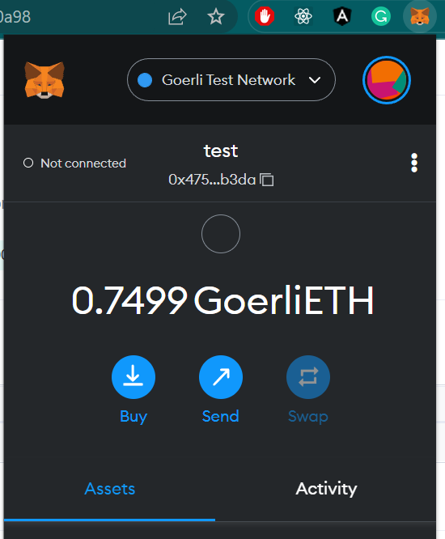
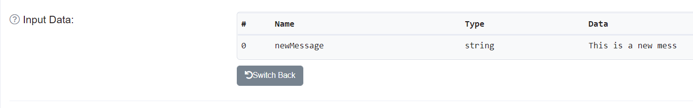

# hello-world

This is my first projects on Ethereum.

[YouTube Playlist](https://www.youtube.com/watch?v=g73EGNKatDw&list=PLMj8NvODurfGgDJG-qQWyKtqTxJyRGI0i)

## Tech

- Ethereum smart contracts
- hardhat
- Alchemy Provider
- Goerli - network

## Setup

You can clone this repo and get going right away.

Just make sure to:

- run `npm install` to set up all the dependencies (hardhat, ethers, etc.)
- rename `.env-example` to `.env` and then fill in the environment variables with your own info
- set up an Alchemy account [here](https://alchemy.com/?a=641a319005)
- set up a [Metamask](https://metamask.io/download.html) wallet with [fake testnet ether](https://faucet.dimensions.network/)

  

And then you should be able to:

- run `npx hardhat run scripts/deploy.js` to deploy the contract to the Ropsten testnet
- run `npx hardhat run scripts/interact.js` to read and write a new message to the smart contract on Ropsten
- run `npx hardhat verify --network goerli <your deployment address> 'Hello World!'` to verify your contract on Etherscan

  

